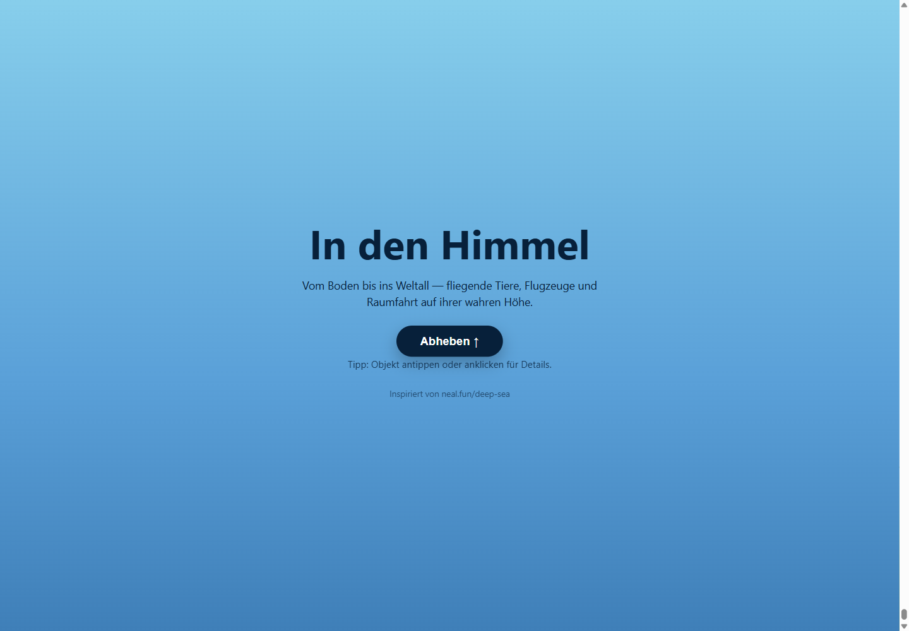

# In den Himmel 🪶🚀

**Live: [in-den-himmel.pages.dev](https://in-den-himmel.pages.dev/)**

> **EN (TL;DR):** An interactive scroll page, the counterpart to neal.fun/deep-sea: instead of
> diving into the ocean you scroll **upwards**, from the ground into space. 155 objects (animals,
> aircraft, spacecraft) appear at their scientifically documented real altitudes. Vanilla JS,
> no framework, no build step, fully bilingual (DE/EN). Images were researched, licensed-checked
> and processed by a multi-agent AI pipeline (researcher, critic, downloader, background removal).

Eine interaktive Scroll-Seite als Gegenstück zu [neal.fun/deep-sea](https://neal.fun/deep-sea/):
Statt in die Meerestiefe zu tauchen, **scrollst du nach oben in den Himmel und ins Weltall**.
Fliegende Tiere erscheinen auf ihrer **wissenschaftlich dokumentierten maximalen Flughöhe** –
danach Flugzeuge und schließlich die Raumfahrt in zwei Kategorien:
**bemannt** (ISS, Mond, Apollo) und **unbemannt** (Hubble, JWST, Curiosity, Voyager).



## Starten
**[in-den-himmel.pages.dev](https://in-den-himmel.pages.dev/)** öffnen — oder lokal:
einfach **`index.html` doppelklicken**, läuft komplett offline im Browser, kein Server, kein Build.

> Optional zum Entwickeln/Testen mit lokalem Server:
> `python -m http.server 8731` und dann `http://127.0.0.1:8731/` öffnen.

## Bedienung
- **Hochscrollen = aufsteigen.** Start am Boden (0 m), der Höhenmesser oben rechts zählt mit.
- **DE / EN** oben links schaltet die Sprache um.
- **„Springe zu …"** teleportiert zu Boden, höchstem Vogel, Stratosphäre, Weltraum, Mond, Voyager 1.
- **Klick auf ein Objekt** öffnet Details (Fakt, wiss. Name, Quelle).

## Aufbau
| Datei | Inhalt |
|-------|--------|
| `index.html` | Grundgerüst + UI-Elemente |
| `styles.css` | Layout, Höhenmesser, Boden, Atmosphären-Bänder, Modal, Responsive |
| `data.js` | **Inhalts-Datenbasis** (Tiere, Flugzeuge, Raumfahrt) – hier neue Objekte ergänzen |
| `script.js` | Höhen-Skalierung, Szenen-Aufbau, Canvas-Hintergrund, Interaktion |
| `tools/prep_images.py` | Bilder freistellen + skalieren (rembg) |
| `CREDITS.md` | Bild- und Quellennachweise |

## Höhen-Skala
Damit der dichte Tier-Bereich (0–12 km) erlebbar bleibt und trotzdem Voyager (~24 Mrd. km)
erreichbar ist, ist die Skala zweigeteilt:
- **0–100 km:** abschnittsweise linear (unten viele Pixel pro Meter, oben weniger).
- **ab 100 km:** logarithmisch (feste Pixel pro Zehnerpotenz der Distanz).

## Bilder hinzufügen
Die Seite zeigt zunächst **Emoji-Platzhalter**. Für echte freigestellte Fotos:
1. Pro Objekt ein frei lizenziertes Bild laden (Wikimedia Commons für Tiere, NASA für Raumfahrt).
2. Ablegen als `images/raw/<id>.jpg` – `<id>` = das `id`-Feld aus `data.js` (z. B. `sperbergeier.jpg`).
3. `pip install pillow rembg onnxruntime`
4. `python tools/prep_images.py` → erzeugt `images/<id>.png` (Hintergrund entfernt, skaliert).
5. Nachweise in `CREDITS.md` eintragen.

## Neues Objekt ergänzen
In `data.js` einen Eintrag im Array `SKY_DATA` hinzufügen:
```js
{ id:"adler2", cat:"bird", emoji:"🦅", altitude_m:5000,
  name:{de:"…", en:"…"}, sci:"…", note:"typisch",
  fact:{de:"…", en:"…"},
  img:"images/adler2.png", credit:"…", license:"CC BY-SA", source:"https://…" }
```
`cat`: bird · insect · bat · spider · aircraft · manned · unmanned · reference
`note`: typisch · extremwert · extremereignis · laborwert · bodenhoehe · referenz

## Wie es gebaut wurde

Das Projekt ist komplett mit einem **KI-Agenten-Workflow** entstanden (Claude Code):

- **Inhalte:** Recherche-Agenten haben Flughöhen, wissenschaftliche Namen und Fakten
  zusammengetragen; ein Kritiker-Agent hat jede Angabe gegen Quellen geprüft
  (Widerspruchs-Checks in `eval/`).
- **Bilder:** Eine mehrstufige Pipeline (`eval/img-harness/` + `tools/`) hat pro Objekt
  frei lizenzierte Kandidaten gesucht (Wikimedia Commons, NASA), ein Kritiker hat
  ausgewählt, danach automatischer Download, Freistellung per rembg und Skalierung.
  Objekte ohne sauber lizenziertes Material behalten bewusst ihren Emoji-Platzhalter.
- **Qualität:** Visual-Checks per Playwright, Code-Review-Berichte in `eval/`.

Alle Bild- und Quellennachweise: [`CREDITS.md`](CREDITS.md), [`CREDITS_GROUND.md`](CREDITS_GROUND.md),
[`CREDITS_SPACE.md`](CREDITS_SPACE.md) — zusätzlich zeigt jedes Objekt-Modal Quelle und Lizenz direkt an.

---
Inspiriert von neal.fun/deep-sea. Höhenangaben recherchiert und faktengeprüft (Mai 2026).
Ein Projekt von [Jens Geerkens](https://geerkens.ai) · jens@geerkens.ai
